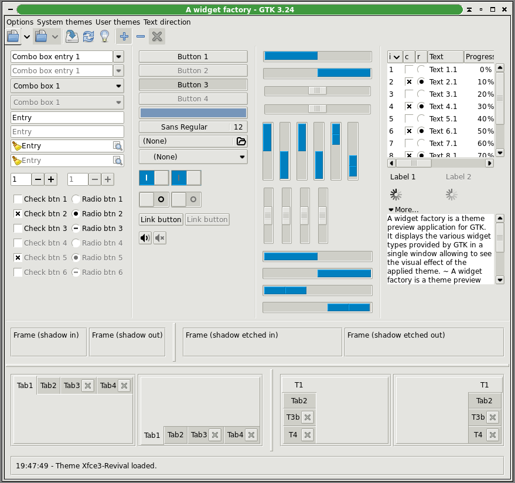

# xfce3-revival-theme
Xfce3-Revival is a GTK3 theme based on the look of XFCE 3.8's xfce GTK1 engine. The theme is, however, written from scratch with no original XFCE code and placed in the public domian. While the general look of XFCE 3 is replicated, pixel-perfect recreation has not been attempted. I have, however, provided a selection of color varients linked to the main theme based on some of what I hope were the more interesting color palettes shipped with XFCE 3.

__This theme is in no way endorsed or supported by the XFCE desktop.__ Please direct all pleas for help to me. I'm the madman trying to bring 2002 XFCE's looks to 2025's XFCE.

## Examples
Here is what the theme looks like in practice:

| Multiple              | Color                 | Variants                    |
| --------------------- | --------------------- | --------------------------- |
| Alpine                | Analogue              | Dust                        |
|  |  |        |
| Fall                  | Golden                | Grayscale                   |
|      |  |  |
| Mauve                 | Sunny                 | Troica                      |
|    |    |        |

__Update__: There are now GTK2 settings for each color scheme! For these you will need the xfce GTK2 engine. On Debian systems the package for this is gtk2-engines-xfce, which has been dropped from the distribution but still installs correctly from the archives. I'm taking advantage of the GTK2 xfce-smooth look, which isn't identical to the GTK1 theme I originally copied but is very close.

## Limitations
- There is not (yet) any attempt to recreate the XFCE 3 themes that used a repeating texture for window and widget backgrounds.
- Because this is a new, from-scratch theme there are probably many, *MANY* edge cases and unusual UI structures it does not properly handle. The initial release has been tested against AWF GTK 3,the XFCE 4.20 settings panels, and not much else.
- And as briefly mentioned above, this is not a pixel-perfect recreation of GTK1 UI. Key differences include listbox and textbox border styles, exact button sizes and spacing, and the presence of separate styling for non-focused selections.

## No Copyright Restrictions
xfce3-revival was written in entirety by Timothy Gaskell in 2026 and is placed in the public domain under the Creative Commons CC-0 public domain declaration. Please do not submit pull requests unless your code is also fully original and placed in the public domain.

In my experience, theme designers create first, share second, and think about paperwork only third if at all. There is much more danger of finding a theme that cannot be distributed because the author mixed GPL-2-only and GPL3 code or some such boring legal impossibility than of finding your theme co-opted by evil corporate interests. Accordingly, I prefer to share original work with as few strings as possible attached, not even requiring attribution.

Blessings,

Timothy N. Gaskell

Eastertide, 2026
